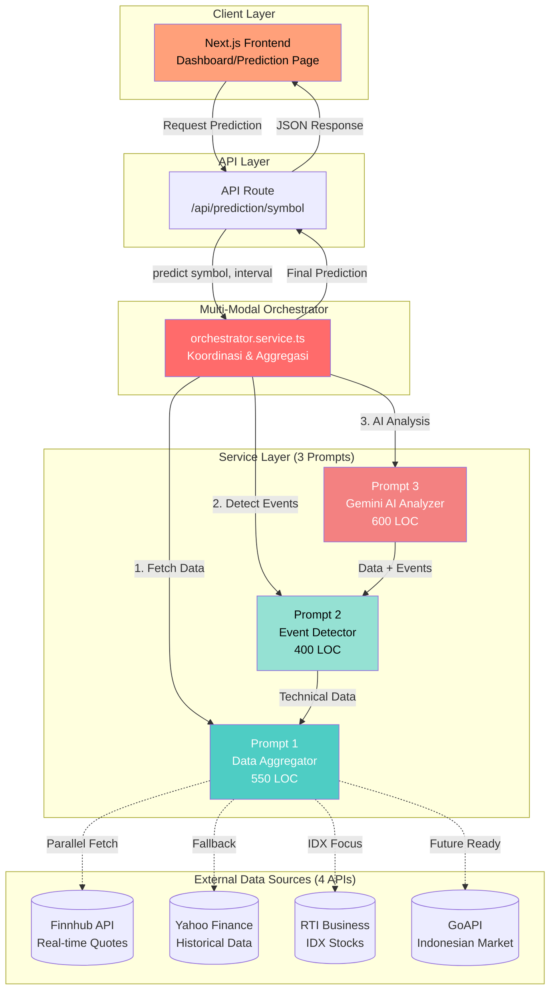
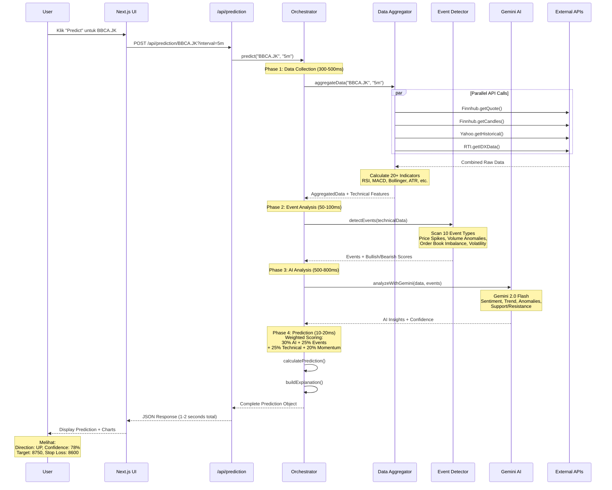
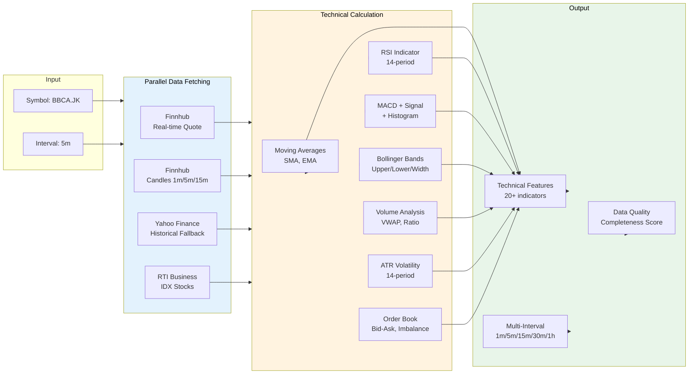
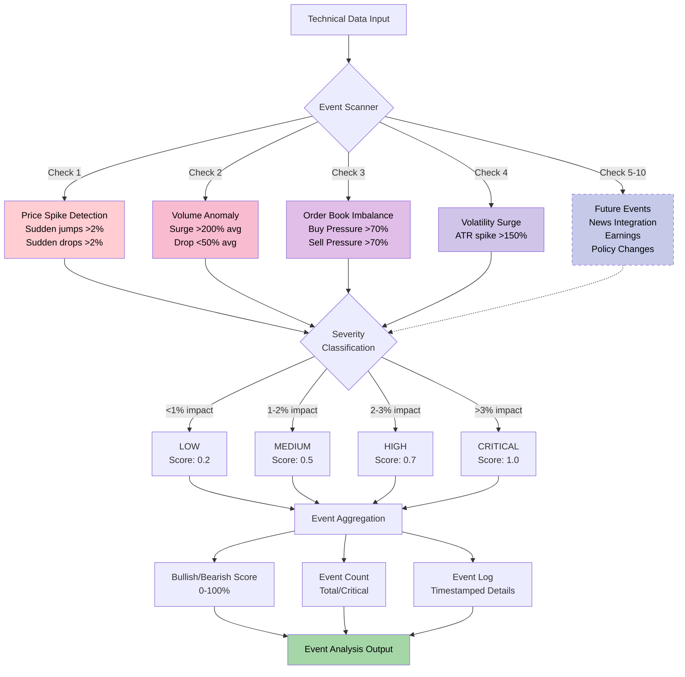
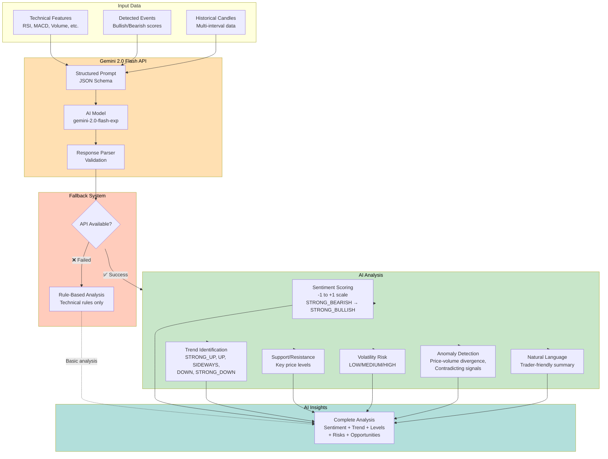
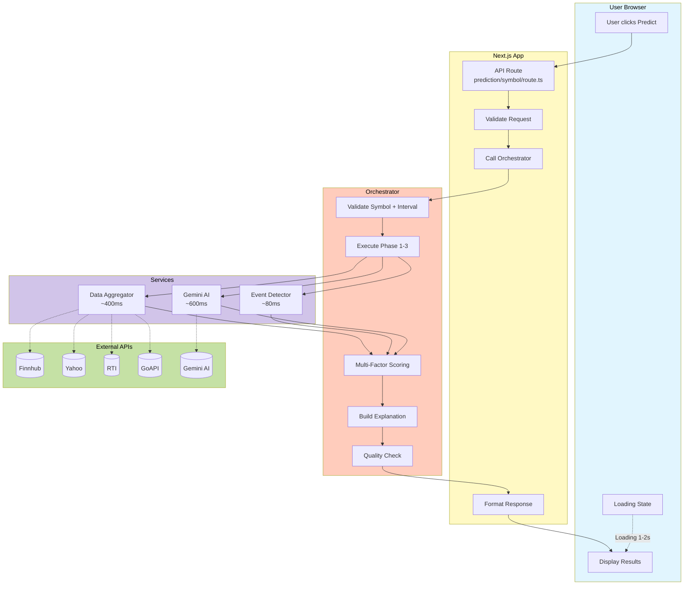
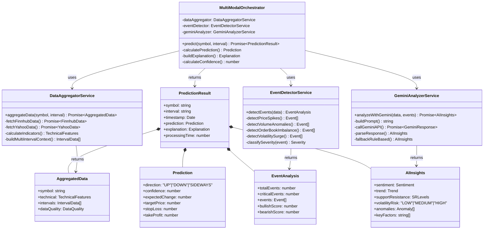
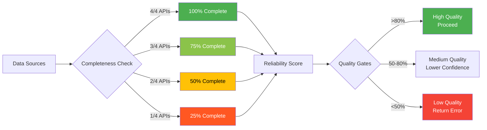

# System Architecture - Visual Diagrams

> **Dibuat:** 24 Oktober 2025  
> **Project:** IKODIO Stock Prediction Platform  
> **Teknologi:** Multi-Modal Event-Driven AI System

---

## Daftar Diagram

1. [High-Level System Architecture](#1-high-level-system-architecture)
2. [Multi-Modal Prediction Flow](#2-multi-modal-prediction-flow)
3. [Data Aggregation Pipeline](#3-data-aggregation-pipeline)
4. [Event Detection Engine](#4-event-detection-engine)
5. [AI Analysis Process](#5-ai-analysis-process)
6. [Complete Request-Response Flow](#6-complete-request-response-flow)
7. [Component Relationships](#7-component-relationships)

---

## 1. High-Level System Architecture



---

## 2. Multi-Modal Prediction Flow



---

## 3. Data Aggregation Pipeline



---

## 4. Event Detection Engine



---

## 5. AI Analysis Process



---

## 6. Complete Request-Response Flow



---

## 7. Component Relationships



---

## Performance Metrics

| Phase       | Component              | Avg Time | Max Time |
| ----------- | ---------------------- | -------- | -------- |
| **Phase 1** | Data Aggregation       | 400ms    | 600ms    |
| **Phase 2** | Event Detection        | 80ms     | 150ms    |
| **Phase 3** | AI Analysis (Gemini)   | 600ms    | 1000ms   |
| **Phase 3** | AI Analysis (Fallback) | 50ms     | 100ms    |
| **Phase 4** | Prediction Calculation | 15ms     | 30ms     |
| **Phase 5** | Explanation Building   | 15ms     | 30ms     |
| **TOTAL**   | **End-to-End**         | **1.1s** | **1.8s** |

---

## Weighted Scoring Algorithm

```
Final Score = (30% × AI Sentiment)
            + (25% × Event Bias)
            + (25% × Technical Score)
            + (20% × Momentum Score)

Confidence Adjustment:
- Base: 70%
- High Volatility: -10 to -20%
- Mixed Signals: -5 to -15%
- Low Data Quality: -5 to -10%
- Strong Agreement: +5 to +15%

Final Range: 40% - 95%
```

---

## Data Quality Metrics



---

## Notes

- **Total Codebase:** ~1,950 lines (Orchestrator 400 + DA 550 + ED 400 + AI 600)
- **Status:** Phase 1-3 Complete
- **Future:** Phase 4 (Graph Construction), Phase 5 (ML Training)
- **Production Ready:** Yes (with Gemini API key)
- **Fallback System:** Rule-based analysis if Gemini unavailable

---

**Terakhir diupdate:** 24 Oktober 2025  
**Dibuat untuk:** IKODIO Stock Prediction Platform  
**Developer:** @Hylmii
